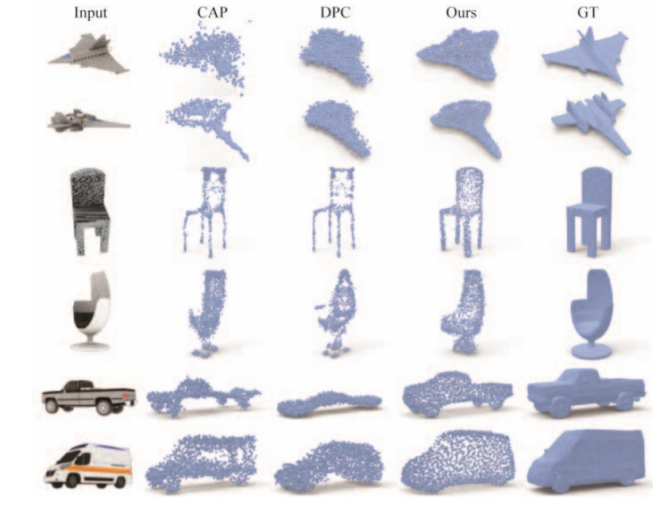
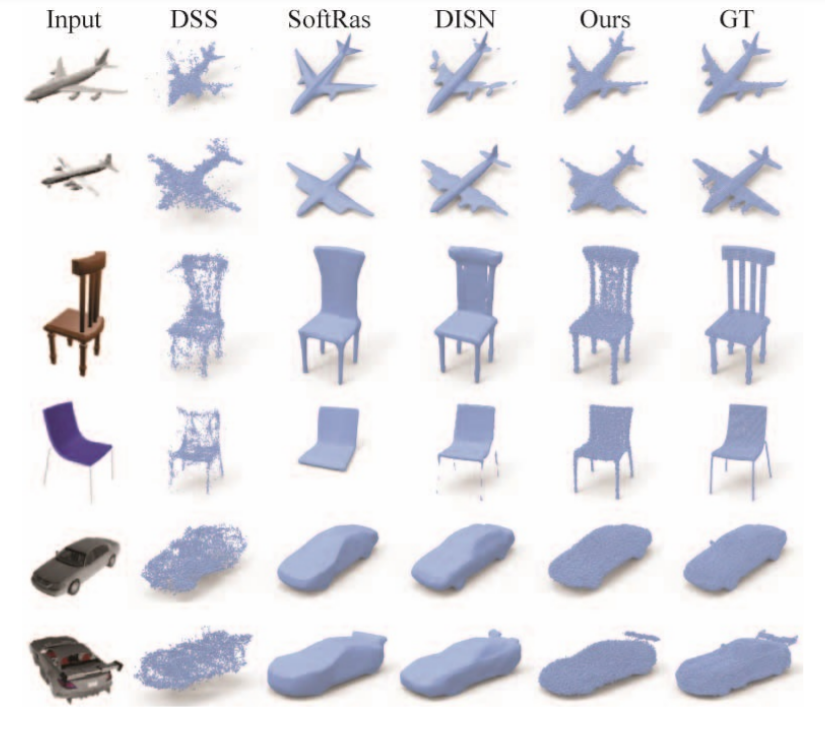

# DRWR: A Differentiable Renderer without Rendering for Unsupervised 3D Structure Learning from Silhouette Images
[paper](https://arxiv.org/pdf/2007.06127.pdf)





## Setup

### Installation

Create virtual environment: 

```
conda create -n drwr_env python=3.6.8
conda activate drwr_env
```

Install dependencies:

```
pip install -r requirements.txt
```

## Dataset and pretrained model

we evaluate our method using [ShapeNet v1](https://www.shapenet.org/) for all experiments. 

The original ShapeNet has no corresponding point clouds and rendered images. Therefore, we need to preprocess 3D meshes to obtain point clouds and rendered images.

We provide the same point clouds and rendered images of 3 classes(chair, plane, and car) used in our paper as [DPC](https://arxiv.org/abs/1810.09381), you can download them by the [link](https://drive.google.com/drive/folders/11EklwTGDShlvV9_631lo-WjL_QFgS1dk), which contains `gt/` and `render/`. the point clouds are only for test. You can also generate ground truth point clouds yourself as described [here](https://github.com/chenchao15/2D_projection_matching/blob/main/2Dpm/densify/README.md).

Firstly, put the `gt/` folder and the  `render/` folder into the `data/` folder.

Secondly, Using the original rendered images to generate silhouettes and 2D sampling points, and save them into TFrecords format (taking the plane(category ID 02691156) as an example): 

```
cd data
./tf_records_generator.sh 02691156
```

A few hours later, you will see the `tf_records/02691156_train.tf_records`.

For convenience, we provide our generated TFrecords files of 3 classes(chair, plane, and car) in the [link](https://drive.google.com/drive/folders/11EklwTGDShlvV9_631lo-WjL_QFgS1dk), which contains `tf_records/`. you can just put the `tf_records/` folder into the `data/` folder.

We also provide our pretrained model `pretrained_model/` and generated shapes `generated_shapes/` in the [link](https://drive.google.com/drive/folders/11EklwTGDShlvV9_631lo-WjL_QFgS1dk). Put the `pretrained_model/` into your **checkpoint_dir**.

## Training

To train our model, you can execute the following, taking the plane(category ID 02691156) as an example:

```
python drwr/scripts/train_eval.py --gpu=0 --synth_set=02691156 --checkpoint_dir=./
```

All trained models will be saved in checkpoint_dir.

See the configurations in **2Dpm/resources/default_config.yaml** for more details.

## Test

```
python drwr/scripts/test.py --gpu=0 --synth_set=02691156 --checkpoint_dir=./ --test_step=100000
```

After the test, we save the quantification results in **checkpoint_dir/result.txt**. The generated 3D shapes are saved in **checkpoint_dir/pred**.

## Acknowledgements

We thank [DPC](https://arxiv.org/abs/1810.09381) for their great works and repos.

## Citation

If you find this project useful in your research, please consider citing:

```
@inproceedings{handrwr2020,
  author = {Zhizhong Han and Chao Chen and Yu-Shen Liu and Matthias Zwicker},
  title = {{DRWR}: A Differentiable Renderer without Rendering for Unsupervised 3{D} Structure Learning from Silhouette Images},
  booktitle = {International Conference on Machine Learning},
  year = {2020},
}
```
